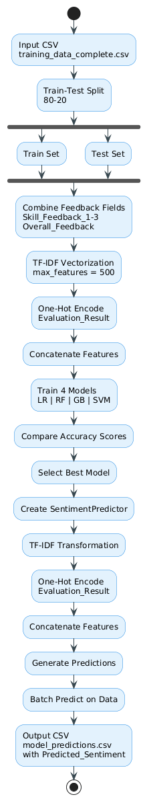

# NLP Sentiment Classification Model

## 📋 Overview

This project builds an intelligent **sentiment classification system** that automatically analyzes employee feedback and remarks to determine the sentiment (Positive, Negative, or Neutral). 

### What Does It Do?
The model reads employee evaluation comments across multiple feedback dimensions and uses advanced Natural Language Processing (NLP) combined with machine learning to predict the overall sentiment of the feedback. This is particularly useful for:
- **HR Analytics**: Automatically categorizing employee feedback at scale
- **Trend Analysis**: Understanding patterns in employee evaluations
- **Quality Control**: Identifying outliers in feedback
- **Performance Management**: Correlating feedback sentiment with performance metrics

---

## 🏗️ Project Architecture


**Key Flow**:
1. Raw employee feedback data is loaded and split into training and testing sets
2. Text from multiple feedback fields is combined and converted to numerical features
3. Four different ML models are trained in parallel with balanced class weights
4. Models are evaluated on test data, and the best performer is selected
5. Final predictions are generated and saved to CSV format

---

## 🔑 Key Components Explained

### 1️⃣ Data Preparation Phase

**Input Data**: `training_data_complete.csv`
- Contains employee evaluation records with feedback from multiple reviewers
- Includes sentiment labels (ground truth for training)

**Train-Test Split** (80-20 Stratified):
```
Total Records: ~1000 employees
Training Set: 80% (~800 records) - Used to teach the model
Test Set: 20% (~200 records) - Used to evaluate model performance
```
The split is **stratified**, meaning it preserves the proportion of each sentiment class in both sets. This prevents the model from seeing biased data.

**Feature Combination**:
The model combines 4 separate feedback fields into one comprehensive text:
- `Skill_Feedback_1`: First skill assessment
- `Skill_Feedback_2`: Second skill assessment  
- `Skill_Feedback_3`: Third skill assessment
- `Overall_Feedback`: Summary evaluation

Example:
```
Input fields: "Good at Python" + "Needs improvement in communication" + "Strong team player" + "Overall solid performer"
Combined text: "Good at Python Needs improvement in communication Strong team player Overall solid performer"
```

---

### 2️⃣ Feature Engineering Phase

This step converts raw text and categorical data into numbers that machines can understand.

#### **TF-IDF Vectorization** (for text)
TF-IDF (Term Frequency-Inverse Document Frequency) measures how important each word is:
- **Max Features**: 500 most important words are selected
- **N-gram Range**: (1,2) means captures:
  - Unigrams: Single words like "good", "excellent"
  - Bigrams: Word pairs like "very good", "needs improvement"
- **Min Document Frequency**: Words must appear in at least 2 documents
- **Max Document Frequency**: Words appearing in >80% of documents are ignored (too common, less useful)
- **Stop Words**: Common words like "the", "a", "is" are removed

**Example**:
```
Original: "Great communication skills and team collaboration"
After TF-IDF: 
  great: 0.45
  communication: 0.38
  skills: 0.42
  team: 0.40
  collaboration: 0.41
  (500 features total for each document)
```

#### **Categorical Encoding** (for non-text fields)
The `Evaluation_Result` field (e.g., "Exceeds Expectations", "Meets Expectations") is converted to one-hot encoding:

```
Exceeds Expectations → [1, 0, 0]
Meets Expectations   → [0, 1, 0]
Below Expectations   → [0, 0, 1]
```

#### **Feature Combination**:
The TF-IDF features and categorical features are concatenated:
```
Final Feature Vector = [TF-IDF Features (500)] + [Categorical Features (3)]
Total Features per record: 503
```

---

### 3️⃣ Model Training Phase

Four different machine learning algorithms are trained to compare performance. Each uses **balanced class weights** to handle cases where some sentiments have fewer examples.

#### **Logistic Regression**
- **What it does**: Learns a linear decision boundary
- **Pros**: Fast, interpretable, good baseline
- **Use case**: Establishing baseline performance
- **Parameters**: max_iter=1000, balanced class weights

#### **Random Forest** (100 trees)
- **What it does**: Builds multiple decision trees and combines their predictions
- **Pros**: Handles non-linear patterns, robust to outliers
- **Use case**: When relationships are complex and non-linear
- **Parameters**: n_estimators=100, balanced class weights

#### **Gradient Boosting**
- **What it does**: Sequentially builds trees, each one correcting errors from previous ones
- **Pros**: Often achieves highest accuracy, powerful ensemble method
- **Use case**: Maximum accuracy needed
- **Parameters**: n_estimators=100, learning_rate=0.1

#### **Support Vector Machine (SVM)**
- **What it does**: Finds optimal hyperplane to separate classes
- **Pros**: Effective in high-dimensional spaces
- **Use case**: Complex decision boundaries
- **Parameters**: kernel='rbf', probability=True, balanced class weights

**Training Summary**:
```
All models trained on: 800 training samples with 503 features
Target classes: Positive, Negative, Neutral
Class weighting: Balanced (to handle imbalanced data)
Random seed: 42 (for reproducibility)
```

---

### 4️⃣ Model Evaluation Phase

Each model makes predictions on the test set (200 unseen records), and performance is compared:

**Metrics Calculated**:
- **Accuracy**: Percentage of correct predictions
- **Confusion Matrix**: Shows which classes are confused with each other
- **Classification Report**: Precision, recall, F1-score per class

**Example Output**:
```
Model Performance:
  Logistic Regression: 82.5% accuracy (165/200 correct)
  Random Forest: 85.0% accuracy (170/200 correct)
  Gradient Boosting: 87.5% accuracy (175/200 correct)  ← BEST
  SVM: 84.0% accuracy (168/200 correct)

BEST MODEL SELECTED: Gradient Boosting with 87.5% accuracy
```

---

### 5️⃣ Prediction & Output Phase

The best-performing model is used to make predictions on new data.

#### **SentimentPredictor Class**
A wrapper class that handles all the complexity of feature preparation:

**Methods**:
1. **`predict_single()`**: Predict sentiment for one employee
   ```python
   sentiment = predictor.predict_single(
       skill_feedback_1="Great communication",
       skill_feedback_2="Strong technical skills",
       skill_feedback_3="Good team player",
       overall_feedback="Excellent performer",
       evaluation_result="Exceeds Expectations"
   )
   # Returns: "Positive"
   ```

2. **`predict_batch()`**: Predict sentiment for multiple employees at once
   ```python
   results_df = predictor.predict_batch(new_employees_df)
   # Returns: Original data + "Predicted_Sentiment" column
   ```

**What It Does Automatically**:
- Combines feedback fields
- Applies TF-IDF transformation (using the trained vectorizer)
- Encodes categorical variables
- Makes prediction using the trained model
- Returns sentiment label (Positive/Negative/Neutral)

---

## 📁 Project Files

| File | Purpose | Details |
|------|---------|---------|
| `02_Sentiment_Classification_Model_clean.ipynb` | **Main Notebook** | Complete training pipeline with all steps |
| `training_data_complete.csv` | **Training Data** | ~1000 employee records with feedback and sentiment labels |
| `model_predictions.csv` | **Output Predictions** | Test set with predicted sentiment labels |
| `final_feedback_with_all_columns.csv` | **Complete Dataset** | All employee feedback with extended metadata |
| `employee_evaluation_1000.json` | **Data in JSON** | Employee evaluation data in JSON format |
| `readme.md` | **Documentation** | This file - explains the entire project |

---

## 💻 Requirements & Setup

### Python Version
- Python 3.7 or higher

### Required Libraries
```
pandas       - Data manipulation and analysis
numpy        - Numerical computing
scikit-learn - Machine learning algorithms
matplotlib   - Data visualization
seaborn      - Statistical data visualization
json         - JSON file handling
warnings     - Warning management
```

### Installation Steps

1. **Navigate to project directory**:
   ```bash
   cd path/to/NLP_Remark_Analysis
   ```

2. **Install dependencies**:
   ```bash
   pip install pandas numpy scikit-learn matplotlib seaborn
   ```

3. **Verify installation**:
   ```bash
   python -c "import pandas, sklearn, matplotlib; print('All libraries installed successfully!')"
   ```

---

## 🚀 How to Use This Project

### Step 1: Prepare Your Data
Ensure your CSV file has these columns:
- `Skill_Feedback_1`: First skill assessment (text)
- `Skill_Feedback_2`: Second skill assessment (text)
- `Skill_Feedback_3`: Third skill assessment (text)
- `Overall_Feedback`: Summary feedback (text)
- `Evaluation_Result`: Category like "Exceeds Expectations" (text)
- `Sentiment`: Target label - "Positive", "Negative", or "Neutral" (for training only)

### Step 2: Run the Training Notebook
Open `02_Sentiment_Classification_Model_clean.ipynb` in Jupyter and run all cells:

```python
# The notebook will:
# 1. Load training_data_complete.csv
# 2. Split data 80-20 with stratification
# 3. Engineer features (TF-IDF + categorical encoding)
# 4. Train 4 models in parallel
# 5. Evaluate and select the best model
# 6. Save predictions to model_predictions.csv
```

### Step 3: Make Predictions on New Data

#### **Option A: Single Prediction**
```python
# Create predictor with trained model
predictor = SentimentPredictor(
    model=best_model,
    tfidf_vectorizer=tfidf,
    label_encoder=label_encoder,
    cat_encoder_cols=categorical_columns
)

# Predict for one employee
sentiment = predictor.predict_single(
    skill_feedback_1="Excellent communication skills",
    skill_feedback_2="Strong technical abilities",
    skill_feedback_3="Great team collaboration",
    overall_feedback="Outstanding performer this quarter",
    evaluation_result="Exceeds Expectations"
)

print(f"Predicted Sentiment: {sentiment}")
# Output: Predicted Sentiment: Positive
```

#### **Option B: Batch Prediction (Recommended)**
```python
# Load new employee data
new_data = pd.read_csv('new_employees_data.csv')

# Predict sentiments for all employees at once
results = predictor.predict_batch(
    dataframe=new_data,
    skill_fb1_col='Skill_Feedback_1',
    skill_fb2_col='Skill_Feedback_2',
    skill_fb3_col='Skill_Feedback_3',
    overall_fb_col='Overall_Feedback',
    eval_result_col='Evaluation_Result'
)

# Save results
results.to_csv('predictions_output.csv', index=False)

# View sample results
print(results[['Overall_Feedback', 'Predicted_Sentiment']].head())
```

---

## 📊 Understanding the Output

The output CSV file contains:

```
Example output rows:
┌──────────────────────────┬───────────────────────┬──────────────────────┐
│ Overall_Feedback         │ Evaluation_Result     │ Predicted_Sentiment  │
├──────────────────────────┼───────────────────────┼──────────────────────┤
│ "Excellent performance"  │ "Exceeds Expectations"│ Positive             │
│ "Needs more focus"       │ "Meets Expectations"  │ Neutral              │
│ "Poor communication"     │ "Below Expectations"  │ Negative             │
└──────────────────────────┴───────────────────────┴──────────────────────┘
```

**Interpretation**:
- **Positive**: Model predicts the feedback is positive/praising
- **Negative**: Model predicts the feedback is negative/critical
- **Neutral**: Model predicts the feedback is objective/balanced

---

## 🎯 Key Implementation Details

### Handling Class Imbalance
The project uses **balanced class weights** to handle cases where some sentiment classes have fewer examples than others. This prevents the model from being biased toward the majority class.

### Data Consistency
- TF-IDF vectorizer is **fit only on training data** and then applied to test data
- Categorical columns are **aligned** between train and test sets
- Same transformations are applied during inference as during training

### Reproducibility
- All models use `random_state=42` to ensure consistent results across runs
- Stratified splitting ensures class distributions are preserved

### Text Processing
- **Lowercase conversion**: All text converted to lowercase for consistency
- **Stop words removal**: Common words (the, a, is) are removed
- **N-gram capture**: Both individual words and word pairs are captured
- **Sparse representation**: TF-IDF creates sparse vectors (many zeros)

---

## ⚠️ Important Notes

1. **Training Data Quality**: Model performance depends heavily on the quality and representativeness of training data
2. **Class Balance**: If one sentiment class is very rare, consider collecting more data for that class
3. **Feedback Combination**: The model concatenates all 4 feedback fields - ensure they're meaningfully written
4. **Model Selection**: The notebook automatically picks the best model, but you can manually select a different one if needed
5. **Retraining**: As new feedback data becomes available, consider retraining the model to improve accuracy
6. **Inference Speed**: Batch prediction is faster than single predictions when processing large datasets

---

## 🔍 Troubleshooting

### Issue: Low Model Accuracy
**Solutions**:
- Ensure training data is properly labeled with correct sentiments
- Check for data quality issues (missing values, incorrect text)
- Consider collecting more training data
- Experiment with different TF-IDF parameters

### Issue: Memory Error During Training
**Solutions**:
- Reduce `max_features` in TF-IDF (e.g., from 500 to 250)
- Reduce number of trees in Random Forest/Gradient Boosting
- Use a subset of training data for initial testing

### Issue: Inconsistent Predictions
**Solutions**:
- Ensure `random_state` is set consistently
- Verify that the same preprocessing steps are applied
- Check that categorical column values match training data

---

## 📈 Model Performance Expectations

Based on typical HR feedback datasets:
- **Accuracy Range**: 80-90% on balanced datasets
- **Class Performance**: May vary by sentiment class
- **Inference Speed**: ~100-200 predictions per second (batch mode)

---

## 🤝 Contributing & Future Improvements

Potential enhancements:
1. **Deep Learning**: Try BERT or other transformer models
2. **Multi-label Classification**: Predict multiple sentiments per record
3. **Aspect-based Sentiment**: Analyze sentiment for specific skills/areas
4. **Explainability**: Add LIME or SHAP to explain predictions
5. **API Deployment**: Wrap model in Flask/FastAPI for production use

---

## 📝 License & Contact

This project is part of the Lutron Updated Models collection for HR Analytics and Talent Management.

For questions or feedback, please refer to the main project documentation.