# Training Module Delay Predictor

A machine learning model that predicts the delay (in days) for training modules based on historical training data.

## Overview

This project uses an ensemble of **GradientBoostingRegressor** and **RandomForestRegressor** models (via `VotingRegressor`) to predict how many days a training module will be delayed from its scheduled completion date.

## Project Structure

```
training_module_delay_predictor/
├── model.ipynb           # Main Jupyter notebook with model training and evaluation
├── train_data.csv        # Training dataset
├── test_data.json        # Test dataset (JSON format)
├── test_data_500.json    # Test dataset with 500 samples
├── test_data_1000.json   # Test dataset with 1000 samples
└── README.md             # This file
```

## Features Used

The model uses 17 engineered features:

| Feature | Description |
|---------|-------------|
| `Batch_Size` | Number of participants in the training batch |
| `Planned_Duration` | Planned duration of training (in days) |
| `Start_Delay` | Difference between actual and planned start date |
| `Planned_Start_Date_month` | Month of planned start date |
| `Planned_Start_Date_day` | Day of planned start date |
| `Planned_Start_Date_dayofweek` | Day of week (0=Monday, 6=Sunday) |
| `Planned_Start_Date_quarter` | Quarter of planned start date |
| `Actual_Start_Date_month` | Month of actual start date |
| `Actual_Start_Date_day` | Day of actual start date |
| `Actual_Start_Date_dayofweek` | Day of week of actual start |
| `Actual_Start_Date_quarter` | Quarter of actual start date |
| `Planned_Weekend` | Flag if planned start is on weekend |
| `Actual_Weekend` | Flag if actual start is on weekend |
| `Course_Category_Encoded` | Label encoded course category |
| `Batch_Category_Encoded` | Label encoded batch size category |
| `Category_Delay_Mean` | Mean delay for the course category |
| `Module_Delay_Mean` | Mean delay for the specific module |

## Model Architecture

- **GradientBoostingRegressor**: n_estimators=100, max_depth=3, learning_rate=0.1
- **RandomForestRegressor**: n_estimators=100, max_depth=5
- **VotingRegressor**: Ensemble combining both models

## Evaluation Metrics

The model is evaluated using:
- **MAE** (Mean Absolute Error)
- **RMSE** (Root Mean Squared Error)
- **R² Score**

### Prediction Accuracy Categories

| Category | Error Range |
|----------|-------------|
| Exact Match | 0 days error |
| Close Enough | 1-2 days error |
| Moderate | 3-5 days error |
| Not Close | >5 days error |

## Usage

### Prerequisites

```bash
pip install pandas numpy scikit-learn
```

### Running the Model

1. Open `model.ipynb` in Jupyter Notebook or VS Code
2. Run all cells sequentially
3. The model will:
   - Load and preprocess training data
   - Train the ensemble model
   - Make predictions on test data
   - Display accuracy metrics and detailed results

### Input Data Format

The model expects JSON input with the following fields:

```json
{
  "Training_ID": "TRN001",
  "Module_Name": "Python Basics",
  "Course_Category": "Programming",
  "Trainer": "John Doe",
  "Batch_Size": 25,
  "Planned_Start_Date": "2025-01-15",
  "Actual_Start_Date": "2025-01-16",
  "Planned_End_Date": "2025-01-20"
}
```

### Output

The model predicts:
- `Predicted_Delay`: Number of days the training will be delayed
- `Predicted_End_Date`: Calculated end date based on prediction

## Model Workflow Diagram

```mermaid
graph TD
    subgraph "Cell 1: Data Loading and Preprocessing"
        A[Load train_data.csv] --> B[Analyze Delay Patterns by Course_Category]
        B --> C[Analyze Delay Patterns by Module_Name]
        C --> D[Create Pattern Dictionaries: category_delay_mean, module_delay_mean, global_delay_mean]
        D --> E[Convert Date Columns to Datetime]
        E --> F[Calculate Planned_Duration]
        F --> G[Extract Date Features: month, day, dayofweek, quarter]
        G --> H[Calculate Start_Delay]
        H --> I[Create Weekend Flags: Planned_Weekend, Actual_Weekend]
        I --> J[Create Batch_Category using pd.cut]
        J --> K[Label Encode: Course_Category, Batch_Category]
        K --> L[Target Encoding: Category_Delay_Mean, Module_Delay_Mean]
        L --> M[Select 17 Feature Columns]
        M --> N[Split Data: train_test_split 80/20]
        N --> O[Train GradientBoostingRegressor]
        O --> P[Train RandomForestRegressor]
        P --> Q[Create VotingRegressor Ensemble]
        Q --> R[Evaluate Model: MAE, RMSE, R2]
    end

    subgraph "Cell 2: Print Accuracy Scores"
        S[Print MAE, RMSE, R2 Score]
    end

    subgraph "Cell 3: Test Data Analysis"
        T[Load test_data_500.json] --> U[Analyze Course_Category Distribution]
        U --> V[Analyze Delay_Days Distribution]
    end

    subgraph "Cell 4: Define Prediction Function"
        W[Define predict_delay Function]
    end

    subgraph "Cell 5: Make Predictions"
        X[Load test_data_1000.json] --> Y[Apply predict_delay Function]
        Y --> Z[Calculate Predicted_End_Date]
        Z --> AA[Calculate Error_Margin]
        AA --> AB[Classify Match Status: Exact, Close, Moderate, Not Close]
        AB --> AC[Print Detailed Results for First 10 Samples]
    end

    subgraph "Cell 6: Accuracy Summary"
        AD[Count Match Status Categories] --> AE[Calculate Overall Accuracy]
        AE --> AF[Print Error Statistics: MAE, Max Over/Under Prediction]
        AF --> AG[Print Match Status Distribution]
    end

    R --> S
    S --> T
    V --> W
    W --> X
    AC --> AD
```



## Key Insights

- **Cloud** courses typically have a 4-day delay pattern
- **Management** courses typically have a 1-day delay pattern
- The model uses both rule-based patterns and ML predictions for optimal accuracy

## License

Internal use only - Infocepts Technologies Pvt. Ltd.

## Author

Training Analytics Team
